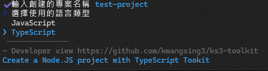

# ks3-toolkit

Node.js 開發專案生成工具-具備基礎的資料庫、I/O、時間轉換、http method 等包裝好的函示。無須安裝，需要開新專案時呼叫即可。

依照開發語言主體 JS/TS 各自引用不同的程式碼檔案。

NPM:
[ks3-toolkit (www.npmjs.com)](https://www.npmjs.com/package/ks3-toolkit)

Github Package:
[ks3-toolkit (Github Package)](https://github.com/kwangsing3/ks3-toolkit/pkgs/npm/ks3-toolkit)

# Usage

```bash
npx ks3-toolkit
```

```
package.json
|
|--- src --- index.ts (index.js)
|        |
|        |--- toolkit (copy from src/Toolkit)
|
|--- Readme.MD
|--- ...
|--- ...
```



# Develop

### 添加項目

- 新增更通用的項目，包裝成獨立函式後提交。

### 修改項目

- 較多為後續的重構或因版本變化的更新需求而修改。

# 值得注意的事項

- Typescript 有其相對於 Javascript 獨特的定位，在同時被不同的領域(網頁、框架、伺服器)使用時，其所需要符合的架構規範 (ESM)
  tsconfig.json 常有非常詭異設定方式。

所以此專案使用的概念是:

1. 不需要 tsc 編譯成.js 也能執行，這點包括 npx ，能夠使用 node 直接運行。
2. 當需要編譯出.js 時，註解 tsconfig.json 的內容

```json
...
   "noUncheckedSideEffectImports": true,
    "moduleDetection": "force",
    "skipLibCheck": true,
    //"allowImportingTsExtensions": true,
    //"noEmit": true,
    "forceConsistentCasingInFileNames": true
...
```

不過在編譯後，原.ts 檔內的引用的項目需要轉換成.js，想當然整段執行過程 vsCode 都會是引用不到檔案的。

3. 此專案這樣設定的優點是在開發階段都不再需要等檔案編譯完就能直接執行，斷點也是能正常生效的。

## 所以一開始就要決定好自己的專案是否需要編譯成 JS

因為此專案需要上傳到 NPM，所以還是需要特別編譯過 (本身作為 node_modules 的應用方式不支援直接執行.ts)。

- 此專案需要編譯成 JS
- 用此專案生成出來的專案不需要編譯成 JS 就能執行

所以兩邊的 tsconfig.json 不同，但可以各自取用想要的項目。

##

```bash
git clone https://github.com/kwangsing3/ks3-toolkit

npm install
```

# Version

- 版本藉由帶 tag 的提交進行工作流發佈。


# Extra

```json
{
    "compilerOptions": {
        "target": "ES2022",
        "module": "Node16",
        "moduleResolution": "Node16",
        "outDir": "./build",
        "rootDir": "./src",
        "strict": true,
        "esModuleInterop": true,
        "skipLibCheck": true,
        "forceConsistentCasingInFileNames": true
    },
    "include": [
        "src/**/*"
    ],
    "exclude": [
        "node_modules"
    ]
}
```


